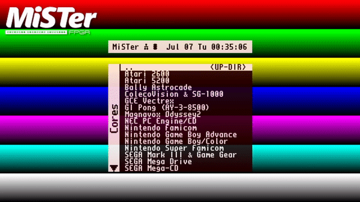
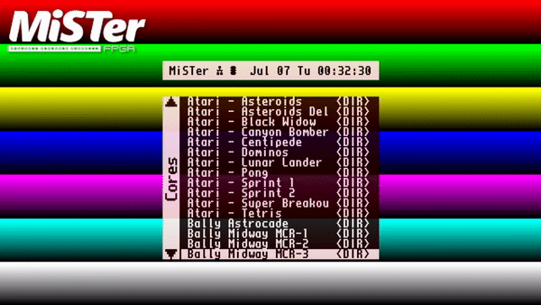

# Names TXT Updater
Enjoy better core names in [MiSTer](https://github.com/MiSTer-devel/Main_MiSTer/wiki) thanks to community curated `names.txt` files



This is the result of applying this script configured to download the japanese `names.txt` version. Versions for other regions are available too.


The downloaded `names.txt` files are curated in the following repository:  
[github.com/ThreepwoodLeBrush/Names_MiSTer](https://github.com/ThreepwoodLeBrush/Names_MiSTer)

Contribute there to improve the naming and the available options.

Special thanks to [Threepwood](https://github.com/ThreepwoodLeBrush) for his work maintaining that repository and curating its files.


## Warning

This script will rewrite your current `names.txt` file if you have one already!


## Setup

Download this [ZIP file](https://github.com/theypsilon/Names_TXT_Updater_MiSTer/raw/master/setups/names-txt_US.zip) and extract `update_names-txt.sh` to your `/Scripts` folder on your primary SD card.

Then turn on your __MiSTer__, go to the _Scripts_ menu and run this script from there.


## Alternative Setups

Other setups that might be useful for you:
- [EU](https://github.com/theypsilon/Names_TXT_Updater_MiSTer/raw/master/setups/names-txt_EU.zip): European names.
- [JP](https://github.com/theypsilon/Names_TXT_Updater_MiSTer/raw/master/setups/names-txt_JP.zip): Japanese names.

NOTE: You should extract also `update_names-txt.ini` in these.


# Arcade Organizer

The `names.txt` files are also readed by the Arcade Organizer when generating the Cores folder.



Here is the result of applying this updater and then the [Arcade Organizer](https://github.com/MAME-GETTER/_arcade-organizer).


## Further Configuration

In case you would like to modify options by hand, you can create a `update_names-txt.ini` file sitting next to where you have placed `update_names-txt.sh`.

You may change the following parameters:

```bash
# Sets the downloaded `names.txt` Region Code to "US", "EU" or "JP"
NAMES_REGION="US"
# Sets the downloaded `names.txt` Char Code to "CHAR18" or "CHAR28"
NAMES_CHAR_CODE="CHAR18"
# Sets the downloaded `names.txt` Sort Code to "Manufacturer" or "Common"
NAMES_SORT_CODE="Common"

# "false" to not reboot automatically after a system component has been updated.
# System component here means menu.rbf, MiSTer binary, Linux, and such.
AUTOREBOOT="true"

###########################
# Troubleshooting Options #
###########################

# Network resilience parameters
CURL_RETRY="--connect-timeout 15 --max-time 240 --retry 3 --retry-delay 5 --silent --show-error"
ALLOW_INSECURE_SSL="true"
```

In order to understand better the implications of the `NAMES_*` options, please read all the explanations from this repository:
[github.com/ThreepwoodLeBrush/Names_MiSTer](https://github.com/ThreepwoodLeBrush/Names_MiSTer)


## Funding

Consider funding [Alexey Melnikov "Sorgelig"](https://www.patreon.com/FPGAMiSTer) for his invaluable work on the [MiSTer project](https://github.com/MiSTer-devel/Main_MiSTer/wiki).


## License

Copyright © 2020, [José Manuel Barroso Galindo](https://twitter.com/josembarroso).
Released under the [GPL v3 License](LICENSE).
